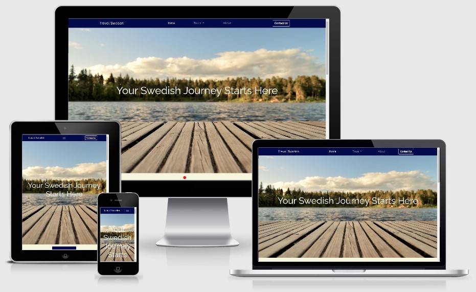
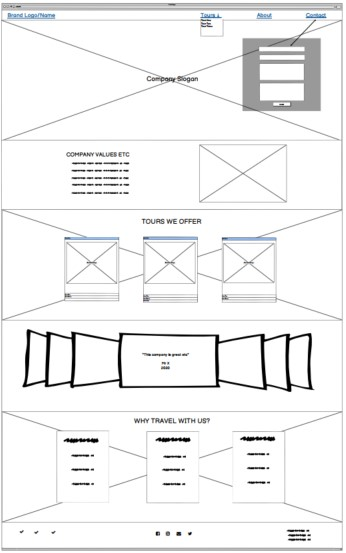
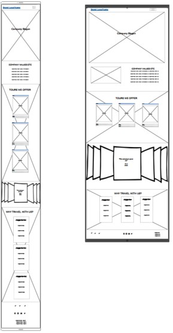
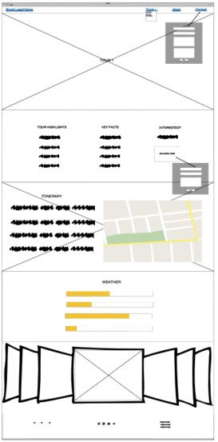
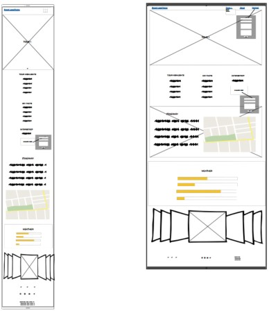
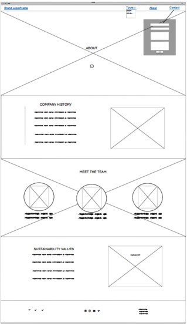
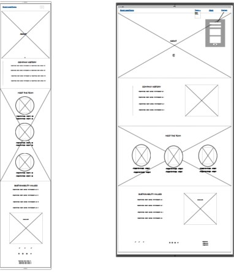

    

# MS1: Travel Sweden.

Project 1: User Centric Frontend Web Development Project for Code Institute.

Designed using HTML, CSS and Bootstrap, this project focusses on a fictional Swedish travel company.

# Access

View the project live: [here](https://adamdelancey.github.io/ms1-travelsweden/)

View the Github repo: [here](https://github.com/adamdelancey/ms1-travelsweden)

# UX

## Strategy

### Business Objectives

1. To increase the number of direct enquiries through the website
2. To provide up-to-date information on the tours, key information and any offers in one place
3. To create an overall positive image for our users by using strong branding

### User stories

-   #### First Time Visitor Goals

    1. As a First Time Visitor, I want to easily understand the services offered by the company and have a positive experience when exploring the website
    2. As a First Time Visitor, I want to be able to easily navigate throughout the site to find any tour that may interest me, and find sufficient information on that tour.
    3. As a First Time Visitor, I want to be able to learn more about the company's goals and values, and easily find the details that I am looking for.
    4. As a First Time Visitor, I want to enjoy high-quality, interesting images of the locations that I am interested in.
    5. As a First Time Visitor, I want to be able to submit an enquiry related to the tour that I am interested in.

-   #### Frequent User Goals
    1. As a Frequent User, I want to check to see if any new tours have been added to the website
    2. As a Frequent User, I want to check to see if any new features have been added

## Scope

### Current features

* Navbar 
    * Dropdown tour menu and contact form modal, which is easily located and acts as an immediate call to action to boost enquiries.

* Home Page
    * Impressive and interesting use of imagery in the hero image and backgrounds of certain sections
    * 3 cards showing the tours that the company offers, giving easy access and allowing the user to quickly see which tours are available and where they are located
    * A review carousel aimed to give a positive impression of the company
    * 3 cards showing the reasons to travel with us, giving short and concise answers.

* Tour Page
    * Impressive and interesting use of imagery in the hero image, backgrounds of certain sections and additionally in the carousel
    * Well presented tour highlights and key facts for the user to easily understand
    * A second enquire button to act as a call to action, which will already have the tour name selected at the top 
    * A day-by-day itinerary and map API from Google Maps to see the location of the tour
    * A weather chart using sliders to see the average rainfall and temperatures at different times of the year

* About Page
    * Impressive and interesting use of imagery in the hero image and backgrounds of certain sections
    * Company history presented as timeline for instant understanding
    * Photos and texts of the team members to make the company appear more personable
    * Sustainability values, including an iframe of carbon emissions so that users can understand their carbon footprint from any flight taken

* Footer
    * Awards won to further the positive impression
    * Social media links
    * Company details such as address, email and phone number

* Responsiveness
    * Website is fully responsive and tested on various mobile devices, iPad and web browsers on desktop.

### Long-term goals

Future improvements to the website may include:

* A blog section to improve SEO and include customer stories and experiences
* Offers on tours to entice customers to make enquiries
* A payment system such as Stripe to take direct bookings and not just enquiries

## Structure

Separate pages - more info tbc.

## Skeleton

### Wireframes

    
    
    
    
    
    

Full wireframes can be accessed here:

-   Home Page Desktop Wireframe - [View](assets/wireframes/home-desktop.pdf)

-   Home Page Mobile & Tablet Wireframe - [View](assets/wireframes/home-tablet-and-mobile.pdf)
    

-   Tour Page Desktop Wireframe - [View](assets/wireframes/tour-desktop.pdf)

-   Tour Page Mobile & Tablet Wireframe - [View](assets/wireframes/tour-tablet-and-mobile.pdf)

-   About Page Desktop Wireframe - [View](assets/wireframes/about-desktop.pdf)

-   About Page Mobile & Tablet Wireframe - [View](assets/wireframes/about-tablet-and-mobile.pdf)

## Surface
   
### Design
-   #### Colour Scheme
    -   The two main colours used are a shade of dark blue, #030a4a, and a beige/offwhite colour, #F5F5DC. Many of the background images used throughout the site also aims to include these colours.
-   #### Typography
    -   The Raleway font is the main font used throughout the whole website with Sans Serif as the fallback font in case for any reason the font isn't being imported into the site correctly. Raleway is an elegant font, frequently used for high-end websites and so was chosen to reflect the quality of the trips sold.
-   #### Imagery
    -   Each page will have a large hero image of spectacular landscapes of the destinations being sold, to act as a selling tool to the user. Images will also be used as backgrounds in certain sections, and there will additionally be a photo gallery for each tour page to further inspire the user to want to travel. Also, all photos were put through [Tiny PNG](https://tinypng.com/) to reduce the file size and improve loading time.
-   #### Icons
    -   Social media icons and on the tour page have been used from [Font Awesome](https://fontawesome.com/)

# Accessibility

## Alt Tags

In order to ensure that all images are accessible for those using a screen reader, I have ensured that the large number of images used throughout the site include alt tags.

## Forms

The forms on the site used in the modals of "Contact Us" and "Enquire Now" have aria-labels so that screen readers can read out what is the required input in the necessary fields.

# Technologies used

## Languages Used

-   HTML5
-   CSS3

## Frameworks, Libraries & Programs Used

1. [Bootstrap 4.5.2:](https://getbootstrap.com/docs/4.4/getting-started/introduction/)
    - Bootstrap was used to assist with the responsiveness and styling of the website, such as the navbar, carousels and cards features.
1. [Google Fonts:](https://fonts.google.com/)
    - Google fonts were used to import the 'Raleway' font into the style.css file which is used on all pages throughout the project.
1. [Font Awesome:](https://fontawesome.com/)
    - Font Awesome was used on all pages throughout the website to add icons for aesthetic and UX purposes. 
1. [Git](https://git-scm.com/)
    - Git was used for version control by utilizing the Gitpod terminal to commit to Git and Push to GitHub.
1. [GitHub:](https://github.com/)
    - GitHub is used to store the projects code after being pushed from Git.
1. [Balsamiq:](https://balsamiq.com/)
    - Balsamiq was used to create the wireframes during the design process.

# Testing

## Validation

The W3C Markup Validator and W3C CSS Validator Services were used to validate every page of the project to ensure there were no syntax errors in the project.

-   [W3C Markup Validator](https://validator.w3.org/)
-   [W3C CSS Validator](https://jigsaw.w3.org/css-validator/)

## Testing User Stories from User Experience (UX) Section

-   #### First Time Visitor Goals

    1. As a First Time Visitor, I want to easily understand the services offered by the company and have a positive experience when exploring the website
        - *This was done with ABC*
    2. As a First Time Visitor, I want to be able to easily navigate throughout the site to find any tour that may interest me, and find sufficient information on that tour.
        - *This was done with ABC*
    3. As a First Time Visitor, I want to be able to learn more about the company's goals and values, and easily find the details that I am looking for.
        - *This was done with ABC* 
    4. As a First Time Visitor, I want to enjoy high-quality, interesting images of the locations that I am interested in.
        - *This was done with ABC*
    5. As a First Time Visitor, I want to be able to submit an enquiry related to the tour that I am interested in.
        - *This was done with ABC*

-   #### Frequent User Goals
    1. As a Frequent User, I want to check to see if any new tours have been added to the website
        - *This was done with ABC*
    2. As a Frequent User, I want to check to see if any new features have been added
        - *This was done with ABC*

## Fixed Bugs
After deployment, I found multiple bugs that needed addressing.

| Bug         | Fix         |
| ----------- | ----------- |
| White margin down right hand side of page on mobile   | Added overflow-x: hidden; to the html and body in CSS  |
| Enquiry and contact modals not working on all pages   | Amended the Bootstrap data-target |
| Text overlapping on About Page history section    | Amended the padding for mobile devices only |
| H1 headings on hero images not central on all devices | Amended padding for best fit using media queries |
| Text on itinerary section not easily readable over background image   | Added a white background color with opacity value of 0.8  |

## Known Outstanding Bugs

| Bug         | Fix         |
| ----------- | ----------- |
| Tour list partly off page in the dropdown menu on smaller mobile devices  | Amended the padding and margin values enough to solve on most mobile devices, but still an issue an smaller the ones.   |
| Carbon Footprint iframe too large for mobile devices | Edited as much as possible to make it fit, but still unsure on best way to edit this.  |
| Submitting enquiry on modal forms does not actually submit itinerary  | Fix with JS, but currently outside the scope of this project. |
 
